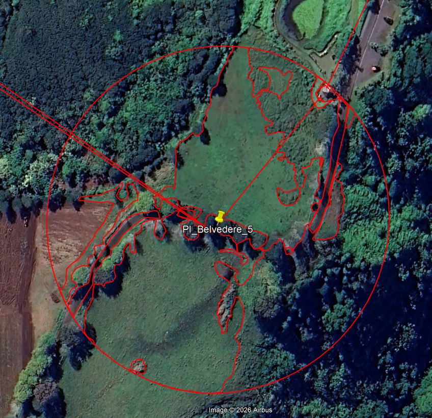
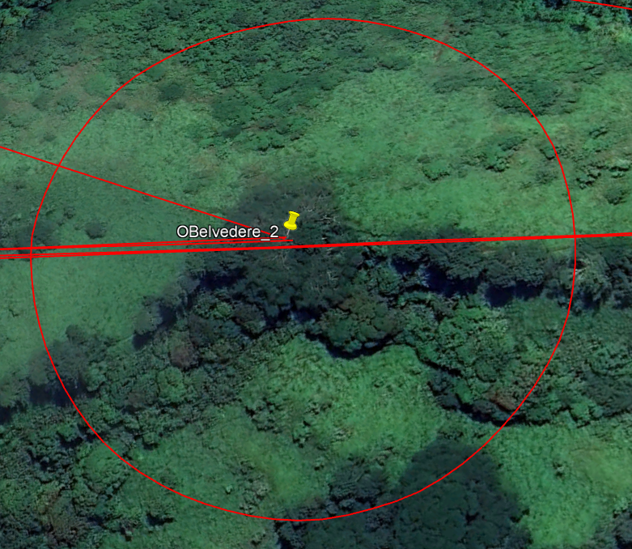
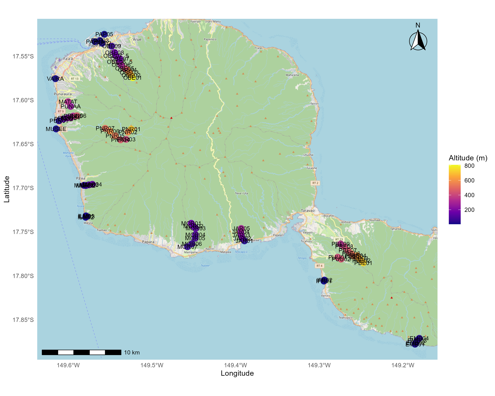

```{r}
#| label: Options
### Customized R options for this document
# Delete this chunk if you don't use R

# Necessary packages. Add all packages used in the code here.
packages_required <- c(
  # R tools, do not modify
  "knitr",
  # Add specific packages here
  "divent",
  "tidyverse", 
  "vegan",
  "readxl",
  "sf",
  "ggspatial",
  "viridis",
  "ggplot2"
)
# Already installed?
packages_installed <- vapply(
  packages_required, 
  FUN = requireNamespace, 
  FUN.VALUE = TRUE, 
  quietly = TRUE
) 
# Install missing packages
install.packages(names(packages_installed)[!packages_installed])

# Allow size='small' or any valid Latex font size in chunk options
def.chunk.hook <- knitr::knit_hooks$get("chunk")
knitr::knit_hooks$set(
  chunk = function(x, options) {
    x <- def.chunk.hook(x, options)
    ifelse(
      options$size == "normalsize", 
      yes = x,
      no = paste0("\n \\", options$size, "\n\n", x, "\n\n \\normalsize")
    )
  }
)

# knitr options (https://yihui.org/knitr/options/)
knitr::opts_chunk$set(
  # Code chunk automatic format if tidy is TRUE
  tidy = TRUE, 
  # Tidy code options: remove blank lines and cut lines after 50 characters
  tidy.opts = list(blank = FALSE, width.cutoff = 50),
  # Font size in PDF output
  size = "scriptsize", 
  # Select PDF figures in PDF output if PDF file exists beside PNG file
  knitr.graphics.auto_pdf = TRUE
)
# Text width of R functions output
options(width = 50)

# ggplot style
library("tidyverse")
# Function to call in each chunk that produces a figure
ggtheme_set <- function() {
  theme_set(theme_bw())
  theme_update(
    panel.background = element_rect(fill = "transparent", colour = NA),
    plot.background = element_rect(fill = "transparent", colour = NA)
  )
}
knitr::opts_chunk$set(dev.args = list(bg = "transparent"))

# Random seed
set.seed(973)
```

```{r}
library(readxl)
data <- readxl::read_excel("data/Data_Globale_Tahiti.xlsx")
library(sf)
library(ggspatial)
library(viridis)
library(tidyverse)
library(ggplot2)
```

```{r}
theme_soundscape <- function() {
  
  theme_minimal() +
    
  theme(
    panel.background = element_rect(fill = "#F8FAFC", colour = NA),
    plot.background  = element_rect(fill = "#F8FAFC", colour = NA),

    panel.grid.major.y = element_line(color = "#CBD5E1", linewidth = 0.4),
    panel.grid.major.x = element_blank(),
    panel.grid.minor = element_blank(),

    axis.text  = element_text(color = "#64748B", size = 11),
    axis.title = element_text(color = "#64748B", size = 12, face = "bold"),

    axis.line = element_line(color = "#64748B", linewidth = 0.5),
    axis.ticks = element_line(color = "#64748B"),

    legend.background = element_rect(fill = "#F8FAFC"),
    legend.text = element_text(color = "#64748B"),
    legend.title = element_text(color = "#64748B", face = "bold")
  )
}
```

# Méthode pour la prise de mesure Google Earth

- La date des images de Google Earth varie entre le 15/07/2023 et le 02/03/2025.

- Un cercle de 100m de rayon est créé autour de chaque enregistreur, égalant une surface de 31416 m².
  Pour les mesures des polygones (HSA et HERB) on zoom pour représenter 1/3-1/4 du cercle avec un angle de plan en zénithal.

- On accumule ensuite les zones délimitées en sommant les valeurs de surface (m²) de nos polygones.
  Attention à bien refaire les polygones pour les sites se chevauchant entre eux (ex: ILM)

- Attention à bien prendre en compte les canopées, même surplombants une route car importants pour les oiseaux.

- Flou entre les routes d'accès en terre et celles en graviers Flou pour les surfaces HERB et la fougère en altitude.
  Doit-elle être considérée dedans ?
  (Oui car zone vraiment herbacée peut ne pas représenter les mêmes habitats et communautés aviaires que les fougères (zone agricole/parc vs versant de vallée)), parfois séparation pas claire entre les deux.

::: {#fig-fougere}
```{r}
#| label: fougere
#| out-width: 70%


```

Séparation parfois complexe entre les vraies zones herbacées et les végétations de fougère (PI_Belvedre_5).
Les fougères peuvent représenter des surfaces importantes (OBelvedere_2).
:::

```{r}
# Graphique HSA
graph_hsa <- ggplot(data, aes(x = site, y = HSA, fill = HSA)) +
  geom_col(width = 0.8, na.rm = TRUE) +
  scale_fill_gradient(
    low = "#DCEAF7",
    high = "#1769AA",
    name = "HSA"
  ) +
  labs(
    x = "Site",
    y = "Hard Surface Area (%)",
  ) +
  theme_soundscape() +
  theme(
    axis.text.x = element_text(angle = 45, hjust = 1)
  )
# Graphique HERB
graph_herb <- ggplot(data, aes(x = site, y = HERB, fill = HERB)) +
  geom_col(width = 0.8, na.rm = TRUE) +
  scale_fill_gradient(
    low = "#E8F5E9",
    high = "#2E7D32",
    name = "HERB"
  ) +
  labs(
    x = "Site",
    y = "Herbaceous vegetation (%)",
  ) +
  theme_soundscape() +
  theme(
    axis.text.x = element_text(angle = 45, hjust = 1)
  )
```

::: {#fig-couvert}
```{r}
# Afficher les deux graphiques
graph_hsa
graph_herb
```

Proportion de HSA et de couvert herbacé par site.
Ces deux variables ne sont pas corrélées entre elles: "cor(HSA,HERB)" = 0.03168
:::

```{r}
sites_sf <- data %>%
  mutate(
    latitude = as.numeric(Latitude),
    longitude = as.numeric(Longitude)
  ) %>%
  sf::st_as_sf(
    coords = c("longitude", "latitude"),
    crs = 4326
  )
```

```{r}
carte_sites_tahiti <- ggplot() +
  annotation_map_tile(
    type = "osm",
    zoom = 12
  ) +
  geom_sf(
    data = sites_sf,
    aes(color = Alt),
    size = 4,
    alpha = 0.9
  ) +
  geom_sf_text(
    data = sites_sf,
    aes(label = site),
    size = 3,
    nudge_y = 0.002
  ) +
  scale_color_viridis_c(
    option = "C",
    name = "Altitude (m)"
  ) +
  annotation_scale(location = "bl") +
  annotation_north_arrow(
    location = "tr",
    style = north_arrow_fancy_orienteering()
  ) +
  labs(
    x = "Longitude",
    y = "Latitude"
  ) +
  theme_minimal()

#ggsave(
#  "carte_sites_tahiti.png",
#  width = 10,
#  height = 8,
#  dpi = 300)
```

::: {#fig-tahiti}
```{r}
#| label: tahiti

```

Carte des 69 sites intégrés dans les enregistrements de paysage sonore.
Les couleurs chaudes représentent les sites de plus haute altitude.
:::

